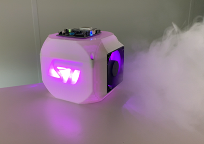
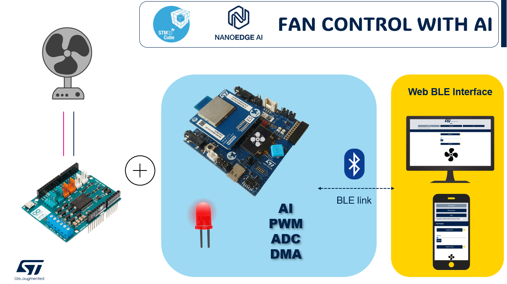
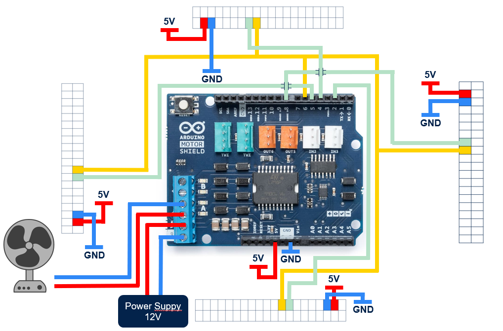
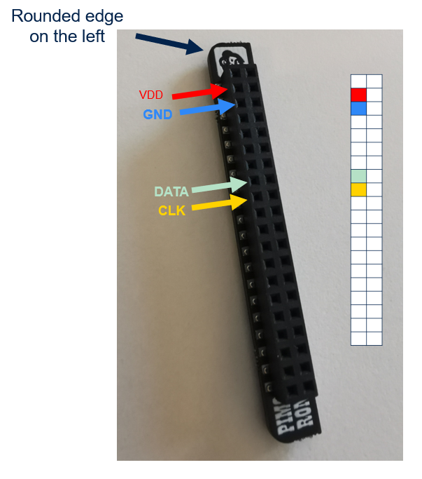
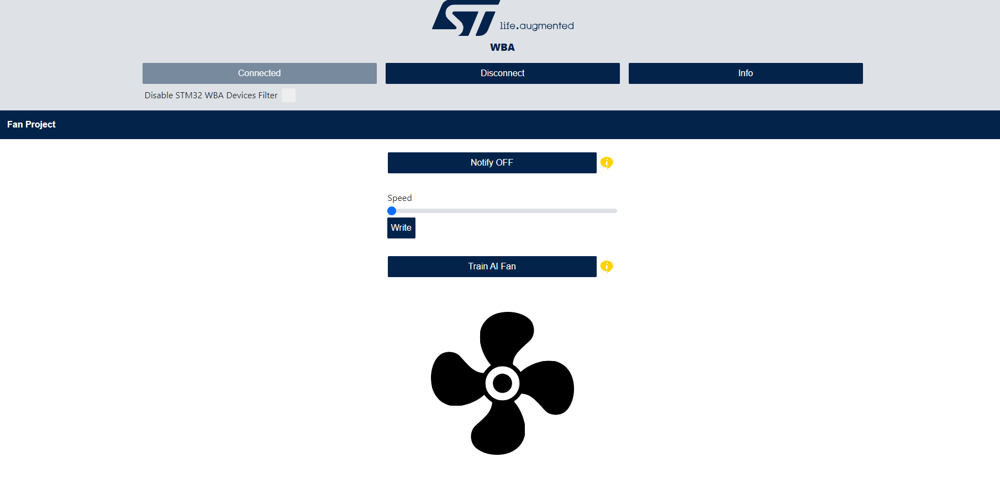

# STM32WBA Bluetooth® LE AI Fan Control

The objective is to showcase the capabilities of the STM32 Ecosystem for WBA customers. This demonstration features a BLE link, an AI algorithm, and motor control operating concurrently.

The selected use case is a fan equipped with anomaly detection, which is reported via BLE.

<div align="center">
    
</div>

## Setup

This example runs on **STM32WBAxx DK board**.

You need hardware to do the same demo:
 * A Fan
 * [Arduino Motor Shield rev3](https://docs.arduino.cc/hardware/motor-shield-rev3/)
 * 4 * [LEDs Bar](https://shop.pimoroni.com/products/blinkt?variant=22408658695) (Not mandatory)
 * 3D Model that you can impress on yourself with the 3D files
 * A phone or a PC

And also software:
 * IDE (CubeIDE or IAR)
 * [NanoEdge AI](https://stm32ai.st.com/nanoedge-ai/) 


Schematic:
<div align="center">
    
</div>


## Schematic 


To use the system without the LED and the screen:
1. Connect the Arduino shield to the WBA Development Kit (DK) using the ST Morpho connectors.
2. Attach the fan's positive (+) and negative (-) terminals to the "Motor A" outputs.
3. Connect a 12V power supply to the Vin and GND terminals.

To incorporate the LED bar:
1. Follow the same initial steps for connecting the Arduino shield and the fan to the WBA DK.
2. Proceed with the additional connections for the LED bar as specified in the provided schematic.

<div align="center">
    
</div>

<div align="center">
    
</div>

To use the DK Screen along with the Arduino shield:

1. **Disconnect** the Arduino shield from the WBA Development Kit to ensure safety while making modifications.
2. **Carefully cut** Pin 12 on the Arduino shield to prevent it from making a connection. This step is crucial to avoid conflicts with other functionalities that may be using this pin.
3. **Create a connection** between Pin 12 and Pin 10. This can be done by connecting a wire between the two pins.

Once these steps are completed:

4. **Reconnect** the Arduino shield to the WBA Development Kit using the ST Morpho connectors.
5. **Ensure** that the fan is still connected to the "Motor A" terminals (+ and -).
6. **Reconnect** the 12V power supply to the Vin and GND terminals.


## Application description

The application contains two modes that can be selected in the `app_conf.h` file.


### **The Data Logger**


The mode allows you to generate your own AI library using NanoEdge AI. It is recommended not to use the pre-existing library, as any discrepancies between your model and the provided model could significantly alter the data input to the AI.

To begin logging data for your AI model:

1. **Open** the firmware project in your preferred Integrated Development Environment (IDE).
2. **Modify** the `app_conf.h` file by setting `DATA_LOGGER` to `1`:

```c
#define DATA_LOGGER 1
```

3. **Save** the changes to the `app_conf.h` file.
4. **Compile** the project to build the firmware with the new configuration.
5. **Flash** the compiled firmware onto the board.

For NanoEdge AI Studio:

1. **Start** a new Anomaly Detection project.
2. **Generate** both regular and abnormal signals, which will be sent via USB with a baud rate of 921,600 bps.

For more information, refer to the [NanoEdge AI documentation](https://wiki.st.com/stm32mcu/wiki/AI:NanoEdge_AI_Studio#Designing_a_relevant_sampling_methodology)


### **The Anomaly detection**

After generating your library, you can proceed to use the main application for anomaly detection.

1. **Open** the firmware project in your preferred Integrated Development Environment (IDE).
2. **Edit** the `app_conf.h` file by setting `DATA_LOGGER` to `0`:

```c
#define DATA_LOGGER 0
```

3. **Save** the changes to the `app_conf.h` file.
4. **Compile** the project to build the firmware with the updated configuration.
5. **Flash** the compiled firmware onto the board.

If you wish to use the LEDs and the screen:

- Ensure the corresponding connections are made and the software is configured to interact with these components:

```c
#define CFG_LED_SUPPORTED                       (1)
#define CFG_LCD_SUPPORTED                       (1)
```

To switch to the shield's power supply:

1. **Change** the jumper JP4 to the `5VVIN` position to use an external power supply.

To use the Web App:

1. **Open** the provided Web App link on a PC or Android smartphone.
2. **Connect** to the Fan Control, which will likely be listed as "FC_XX".
3. **Select** the desired fan speed through the app.
4. **Monitor** for notifications from the app indicating when an anomaly is detected.

This setup allows for remote monitoring and control of the fan, with the added functionality of receiving notifications in case of detected anomalies.


<div align="center">
    
</div>


## Troubleshooting

**Caution** : Issues and the pull-requests are **not supported** to submit problems or suggestions related to the software delivered in this repository. The STM32WBA-BLE-AI-Fan-Control example is being delivered as-is, and not necessarily supported by ST.

**For any other question** related to the product, the hardware performance or characteristics, the tools, the environment, you can submit it to the **ST Community** on the STM32 MCUs related [page](https://community.st.com/s/topic/0TO0X000000BSqSWAW/stm32-mcus).